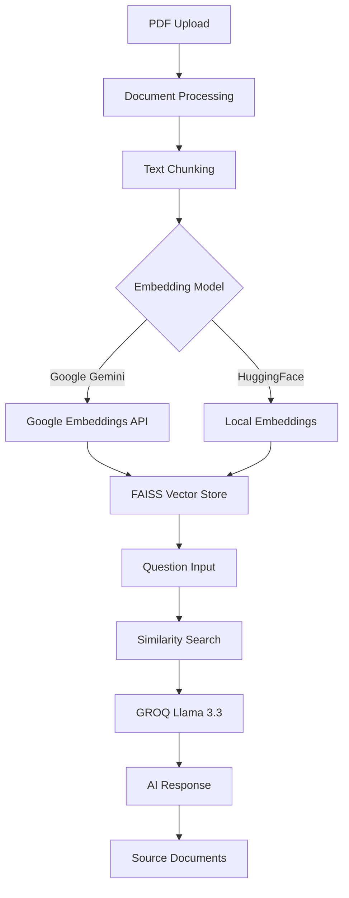

# 📄 PDF Chat with Llama 3.3 - RAG Chatbot

A powerful **Retrieval-Augmented Generation (RAG)** chatbot built with **Streamlit** and **LangChain** that allows you to upload PDF documents and questions about their content using advanced AI models.
Live Link:- https://chat-with-pdfs-rag.streamlit.app/
[](https://streamlit.io/)
[](https://langchain.com/)
[](https://python.org/)
[](https://groq.com/)

## 🌟 Features

### 🚀 **Core Functionality**
- **📚 Multiple PDF Support** - Upload and process multiple PDF documents simultaneously
- **🤖 AI-Powered Q&A** - Ask questions and get intelligent answers based on document content
- **🔍 Source Tracking** - View relevant document sections that were used to generate answers
- **⚡ Real-time Processing** - Fast document processing and response generation

### 🧠 **Dual Embedding Options**
- **🌐 Google Gemini Embeddings** - High accuracy with cloud-based processing
- **🏠 HuggingFace Embeddings** - Local processing with no API rate limits

### 🛡️ **Advanced Features**
- **🔄 Automatic Retry Logic** - Handles API rate limits with exponential backoff
- **📊 Batch Processing** - Processes large documents in manageable chunks
- **💡 Smart Error Handling** - Clear error messages with actionable solutions
- **📈 Performance Metrics** - Track response times and source usage
- **🎨 Modern UI** - Beautiful, responsive interface with progress tracking

## 🏗️ Architecture



## 📋 Prerequisites

- **Python 3.10+**
- **API Keys:**
  - [GROQ API Key](https://console.groq.com/) (for Llama 3.3)
  - [Google AI API Key](https://ai.google.dev/) (for Gemini embeddings)

## 🚀 Installation

### 1. **Clone the Repository**
```bash
git clone https://github.com/Aafimalek/rag-chatbot.git
cd rag-chatbot
```

### 2. **Create Virtual Environment**
```bash
# Using venv
python -m venv venv

# Activate on Windows
venv\Scripts\activate

# Activate on macOS/Linux
source venv/bin/activate
```

### 3. **Install Dependencies**
```bash
pip install -r requirements.txt

# For HuggingFace embeddings (optional but recommended)
pip install sentence-transformers langchain-huggingface
```

### 4. **Set Up Environment Variables**
Create a `.env` file in the project root:
```env
GROQ_API_KEY=your_groq_api_key_here
GOOGLE_API_KEY=your_google_api_key_here
```

## ⚙️ Configuration

### 🔑 **API Key Setup**

#### **GROQ API Key**
1. Visit [GROQ Console](https://console.groq.com/)
2. Sign up/Login and navigate to API Keys
3. Create a new API key
4. Add to `.env` file as `GROQ_API_KEY`

#### **Google AI API Key**
1. Visit [Google AI Studio](https://ai.google.dev/)
2. Create a new project or select existing
3. Enable the Generative AI API
4. Create credentials (API Key)
5. Add to `.env` file as `GOOGLE_API_KEY`


## 🖥️ Usage

### **Start the Application**
```bash
streamlit run app.py
```

### **Using the Application**

1. **📂 Choose Embedding Model**
   - **Google Gemini**: Higher accuracy, requires internet, has API quotas
   - **HuggingFace**: Local processing, no limits, good performance

2. **📄 Upload PDF Documents**
   - Drag and drop or click to browse
   - Multiple files supported
   - View uploaded file details

3. **🚀 Process Documents**
   - Click "Process Documents" button
   - Watch real-time progress updates
   - Wait for processing completion

4. **💬 Ask Questions**
   - Type questions about your documents
   - Get AI-powered responses
   - View source documents used

### **Example Questions**
```
• What is the main topic of the document?
• Summarize the key findings in chapter 3
• What are the conclusions drawn by the authors?
• List the recommendations mentioned in the paper
• Compare the methodologies discussed
```

## 🛠️ Troubleshooting

### **Common Issues**

#### **🚫 API Rate Limits (429 Error)**
```
Error: 429 Resource has been exhausted
```
**Solutions:**
- Wait 5-10 minutes and try again
- Switch to HuggingFace embeddings
- Upload fewer/smaller PDF files
- Check your API quota limits

#### **📦 Missing Dependencies**
```
Error: Could not import sentence_transformers
```
**Solution:**
```bash
pip install sentence-transformers langchain-huggingface
```

#### **🔑 API Key Issues**
```
Error: API key not found
```
**Solutions:**
- Verify `.env` file exists and contains correct keys
- Check API key validity
- Ensure no extra spaces in `.env` file

#### **💾 Memory Issues**
```
Error: Out of memory
```
**Solutions:**
- Process fewer documents at once
- Use smaller PDF files
- Restart the application
- Increase system memory if possible

### **Performance Tips**

1. **📊 For Large Documents:**
   - Use HuggingFace embeddings for unlimited processing
   - Process documents in smaller batches
   - Consider splitting very large PDFs

2. **⚡ For Faster Processing:**
   - Use Google Gemini for smaller document sets
   - Ensure stable internet connection
   - Close other resource-intensive applications

3. **🔄 For Rate Limit Management:**
   - Process during off-peak hours
   - Use batch processing features
   - Monitor API usage regularly

## 📁 Project Structure

```
rag_chatbot/
│
├── 📄 app.py                 # Main Streamlit application
├── 🔐 .env                   # Environment variables (not in repo)
├── 🔐 client_secret.json     # Google credentials (not in repo)
├── 📋 requirements.txt       # Python dependencies
├── 🚫 .gitignore            # Git ignore rules
├── 📖 README.md             # This file
│
├── 📁 .streamlit/
│   └── ⚙️ config.toml       # Streamlit configuration
│
└── 📁 temp/                  # Temporary files (auto-generated)
```

## 📊 Technical Details

### **Models Used**
- **🦙 LLM**: Llama 3.3 70B (via GROQ)
- **🧠 Embeddings**: Google Gemini / HuggingFace Sentence Transformers
- **🔍 Vector Store**: FAISS (Facebook AI Similarity Search)
- **📄 Document Loader**: PyPDF for PDF processing

### **Performance Specifications**
- **📊 Chunk Size**: 1000 characters
- **🔄 Chunk Overlap**: 200 characters
- **📦 Batch Size**: 25-40 documents (adaptive)
- **⏱️ Retry Attempts**: 3 with exponential backoff
- **🕐 Retry Delays**: 2-4 seconds between batches

## 🙏 Acknowledgments

- **[Streamlit](https://streamlit.io/)** - For the amazing web app framework
- **[LangChain](https://langchain.com/)** - For the powerful AI/ML abstractions
- **[GROQ](https://groq.com/)** - For lightning-fast LLM inference
- **[Google AI](https://ai.google.dev/)** - For high-quality embeddings
- **[HuggingFace](https://huggingface.co/)** - For open-source ML models


---

<p align="center">
  <strong>🚀 Happy Chatting with your PDFs! 🚀</strong>
</p>

<p align="center">
  Made with ❤️ using Python, Streamlit, and LangChain
</p> 
